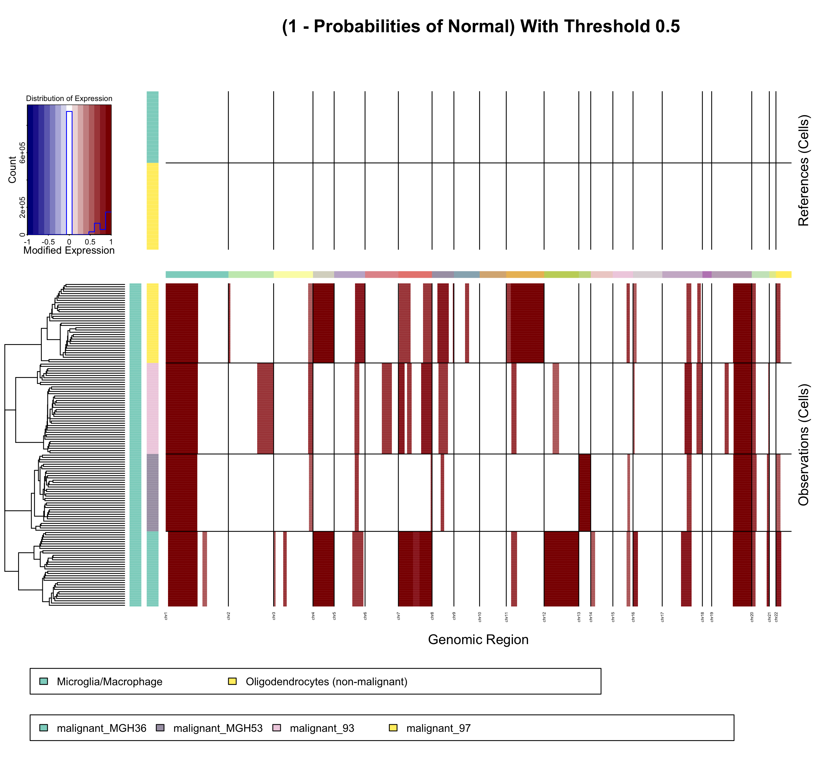
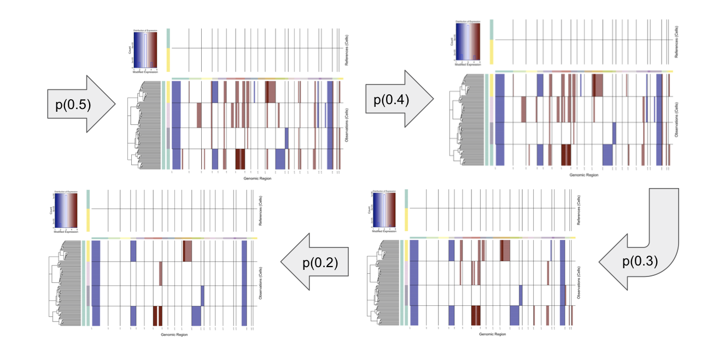

## Intro
#### Posterior Probabilities for CNV States as per Bayesian Network

Given Copy Number Alteration regions identified by the Hidden Markov Model, a Bayesian latent mixture model is implemented to identify the posterior probabilities of alteration status in each cell and whole CNA region. This method is leveraged to combat possible miss identification by the HMM of CNAs or cells that might not be true CNAs (false positives). Several plots are created to better visualize these probabilities in each identified CNA and cell. Diagnostics are preformed in order to ensure the model efficiency. 

## Outline
- Intro
- Methods
- Probability Plots
- Filtering out low-probability CNVs

## Methods 
CNA regions are defined as a subset of adjacent cells and genes that are labeled by the HMM as a single, non-normal CNA state. HMM provides CNA state predictions on an individual gene basis, the multi-state Bayesian mixture model compliments the HMM predictions by providing predictions on a individual cell basis. It is presumed that a single CNA event belongs to a single state, as you cannot have an amplification or deletion of different magnitude occur simultaneously in a single event. Given this notion, multi-state Bayesian mixture model allows for the contrast in probabilities of single CNA regions belonging to each individual CNA state. By default, CNAs with a probability of being normal (represented in the model by the normal state) above a user specified threshold are relabeled as normal states. 

The Bayesian latent mixture model is written in BUGS (Bayesian Inference Using Gibbs Sampling) and implemented using the R package **rjags** for Monte Carlo Markov Chain simulations (Plummer, M. 2013). rjags preforms 1000 iterations, with 500 iterations for adaptation and a burn-in of 200. 


<em> <b>Graphical representation of the Bayesian Network mixture model used to estimate the posterior probability of each cell containing a given CNA.</b> The node GeneExp is the likelihood of the observed gene expression data given parameters &mu;<sub>k</sub> (mean expression for CNV state k) and &tau;<sub>k</sub> (precision = 1/var for CNV state k). C and G represents the number of cells and genes respectively. &epsilon;<sub>j</sub> is the latent variable representing cell specific CNV level (state membership), and &theta; is a hyperparameter corresponding to the probability of each CNA level. Squared values are observed variables, circles correspond to random variables. The &epsilon;<sub>j</sub> (cell-specific CNV whole region state prediction) is the main target of our prediction efforts.</em>

<br><br>
Several [diagnostic visualizations and tables](https://github.com/broadinstitute/infercnv/wiki/Diagnostic-Plots) can be created in order to ensure the efficiency fo the model. By default these diagnostics are not created. In order to be created these diagnostics the diagnostics option should be in settings should be turned on.

<br>

## Probability Plots: 
By default InferCNV generates several posterior probability plots. For each predicted CNV region, the posterior probability of the entire CNA region belonging to each of the 6 states is plotted in ***cnvProbs.pdf***, along with posterior probability of each cell line belonging to each state in ***cellProbs.pdf***. The plot ***NormalProbabilities.png*** visualizes the predicted CNAs on the heat map with color intensities corresponding to the posterior probability of that CNA region not being normal (1-P(cnv=normal)).

The 6 states correspond to the following CNV events:
- State 1; 0x, complete loss. 
- State 2; 0.5x, loss of one copy.
- State 3; 1x, neutral
- State 4; 1.5x, addition of one copy
- State 5; 2x, addition of two copies
- State 6; 3x, essentially a placeholder for >2x copies but modeled as 3x.
<br>


***Box plots showing the posterior probability of each CNV belonging to each possible state.** The arrows point to which CNA regions the box plots correspond to on the heat map.*


<em> 

<br><br><br>

<b> Heat map showing the probability of each CNA being not being normal. </b> Color intensities correspond to the posterior probability between 0 and 1 of the CNA regions not being normal (1 - P(CNV=normal)). The darker the red, the greater the probability that CNA is not normal. 
<br><br><br><br><br><br><br><br>
</em>

## Filtering out low-probability CNVs

CNA regions identified by the HMM are filtered out if the CNA region's posterior probability of being normal exceeds a specified threshold. This combats possibility of miss identified CNAs by removing CNAs that are most likely to be normal and not a true CNV events. 
By default this threshold is set to 0.5, given this any CNA region that has a posterior probability of being of a normal state greater than 0.5 is relabeled as "normal" and no longer considered an identified CNA region. A threshold of 0.5 was chosen for default as it tends to be more lenient threshold. 
This threshold can be adjusted by setting the ```R BayesMaxPNormal``` argument to a value between 0 and 1 in InferCNV's "R run()" function. 
The Bayesian network latent mixture model can be completely avoided by setting ```R BayesMaxPNormal``` to 0. 



<em> 
<b> The following figure shows predicted CNAs and how CNA identification changes as the normal posterior probability threshold changes. </b> The arrows indicate what threshold value is being applied in the visualization. As the threshold decreases, more CNAs are filtered out as more CNAs have normal probabilities above the new decreased threshold. The colors correspond to the level of the deletion or amplification event (states); dark blue:0x, light blue:0.5x, white:1.0x (normal), light red:1.5x, red:2.0x, dark red:3x. These CNAs come from the InferCNV example dataset. 
</em>
