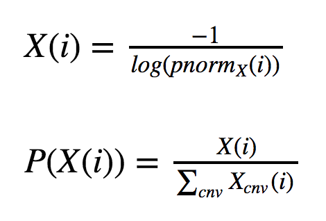
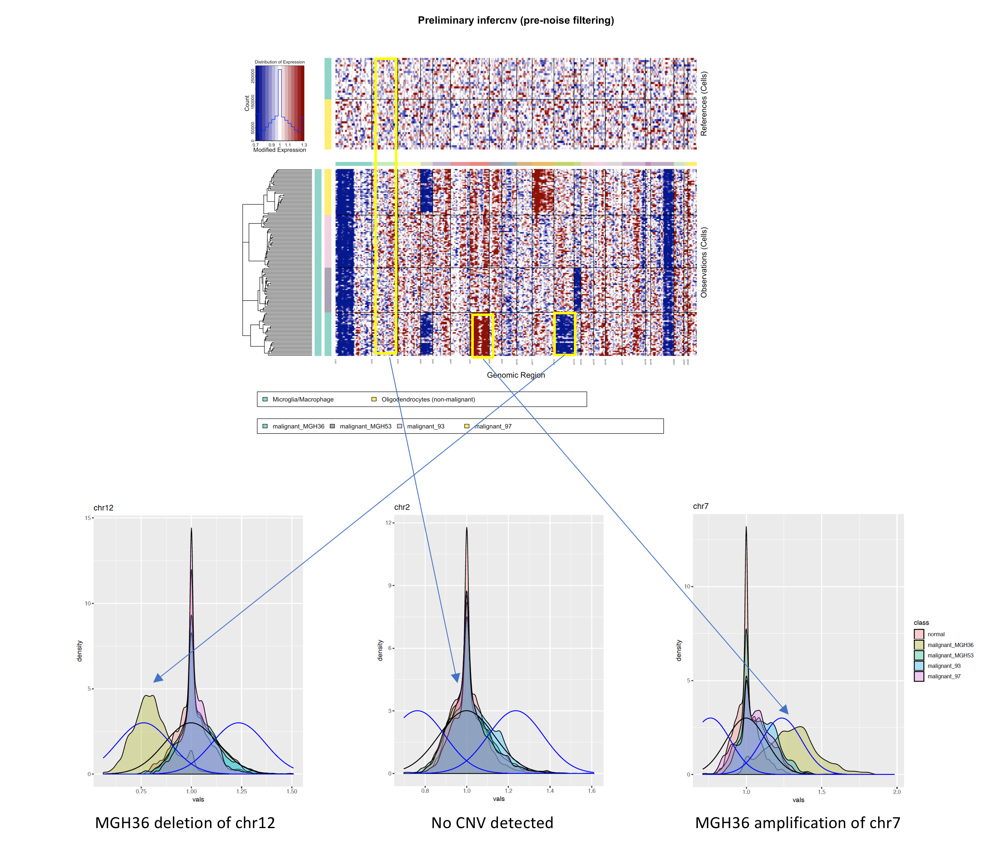

The inferCNV i3 HMM is highly similar to that used by [HoneyBADGER](https://github.com/JEFworks/HoneyBADGER), containing three states representing deletion, neutral, and amplification.  The state model is illustrated below.

The 'preliminary inferCNV object' (reference cells subtracted and smoothed) is used as the target for HMM prediction of CNV.  The expression intensity distributions corresponding to each of the CNV states are set based on the residual tumor cell expression intensities.

The assumption is that most of the tumor cell residual expression intensities are not found in CNV regions. We model the residual expression intensities according to a Gaussian distribution parameterized by Normal(mu, sigma) as estimated based on all residual tumor expression intensities.

Those residual expression intensities that would be considered significantly different from this distribution would be considered evidence for potential amplification or deletion. As in HoneyBADGER, we determine the mean value for amplification or deletion state expression intensities based on a [KS-test](https://en.wikipedia.org/wiki/Kolmogorov%E2%80%93Smirnov_test), requiring that the alternative mean expression intensity fit a distribution with the same variance and be significantly different from the neutral distribution at a p-value of 0.05 (default, '0.05').  This parameterization depends on the number of (k) cells being analyzed within a CNV block, where we model the distribution of the mean for (k) cells.  The greater the number of (k) cells, the tighter the variance for our estimate of the mean (as per the [Central Limit Theorem](https://towardsdatascience.com/understanding-the-central-limit-theorem-642473c63ad8)). 

The HMM state emissions do not directly reflect emission probabilities from these distributions, but rather the reflect the relative likelihood of being emitted from the corresponding distribution.

Emission probabilities are computed as:

where 'i' is the residual expression intensity, and X corresponds to the CNV state parameterization.

As in HoneyBADGER, the alternative state transition probability is fixed to 1e-6.

An example showing the state distributions and residual expression intensities for corresponding samples and chromosomes are shown below:

Above, it's clear how the residual expression intensities match the corresponding deletion, neutral, and amplification states for the corresponding chromosomes and samples.

## Differences between inferCNV and HoneyBADGER implementations of the i3 HMM

Note that HoneyBADGER and inferCNV have many technical differences in data pre-processing prior to reaching the HMM prediction state. In addition, there are differences below in how the i3 HMM is modeled.  It is important to note these differences so that one doesn't attempt to use the inferCNV i3 HMM in place of experimenting directly with HoneyBADGER, as inferCNV i3 is not an exact clone for this method, even though there are many features in common.  We include the i3 HMM as a fall-back and flexible option to be used independently from the inferCNV i6 HMM model.

* in inferCNV, setting the mean for the alt distributions based on the ks-test is based on the number of cells that were sampled. In HoneyBADGER, the sample size for the ks-test is currently fixed at 101.

* in inferCNV, the emission probabilities are modeled based on a relative preference for an expression intensity to be emitted from a given state as compared to the alternative states (see details above).  In HoneyBADGER, the emission probabilities are directly derived from the underlying state distributions.

