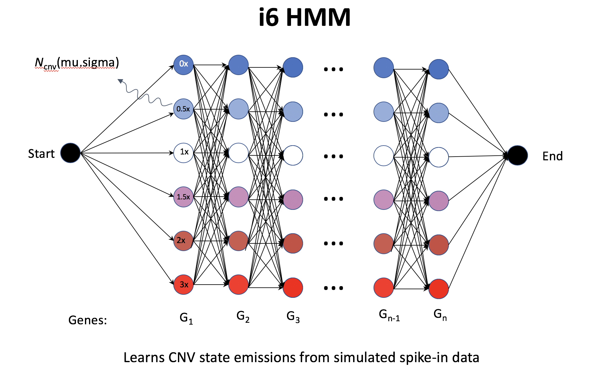
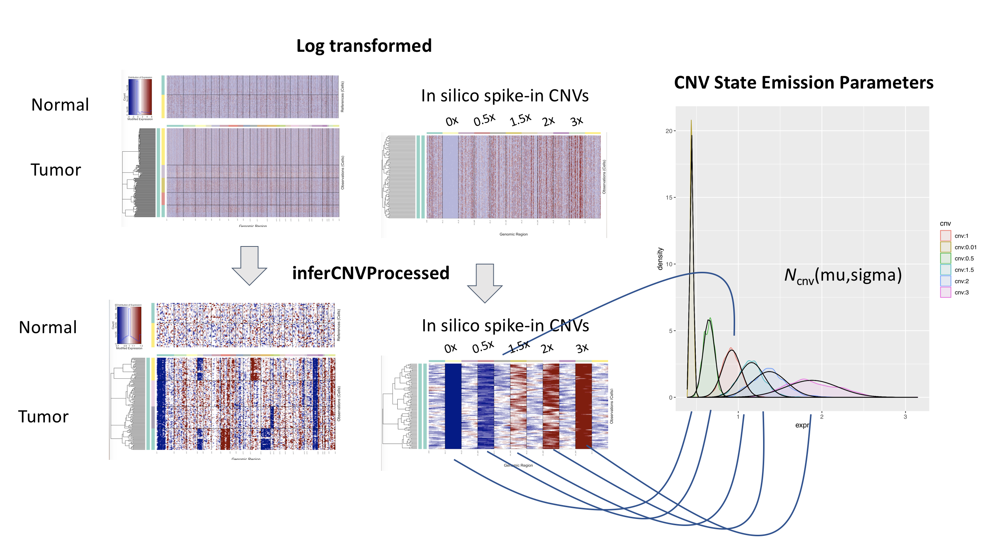

## Outline
- InferCNV i6 HMM
    * Calibrating CNVs residual intensity distributions via the hspike
- Posterior Probabilities for CNV States as per Bayesian Network
- Filtering out low-probability CNVs

## InferCNV i6 HMM

The inferCNV i6 HMM is a six-state CNV model that predicts the following CNV levels:

- 0x: complete loss
- 0.5x: loss of one copy
- 1x: neutral
- 1.5x: addition of one copy
- 2x: addition of two copies
- 3x: essentially a placeholder for >2x copies but modeled as 3x.

The model structure is illustrated below:

The CNV state emission probabilities are modeled based on simulated data.  Specifically, an 'insilico spike-in' data set for normal and tumor cells is simulated based on characteristics of the input normal (reference) cells, matching both the mean/variance expression intensity trend and zero-inflation properties.  Tumor cells are simulated to have chromosomal regions with CNV levels that match each of the six states.  We refer to this 'insilico spike-in' as a 'hidden spike' (or 'hspike').  The hspike data travels along with the input data throughout the inferCNV processing, mirroring the operations applied to the input data (involving normal cell subtractions and chromosome-level smoothing).  The residual expression intensities for the hspike CNV levels are used to calibrate the expression intensity distributions for each CNV state of the i6 HMM.

As in our simpler **i3 HMM**, the HMM state emissions do not directly reflect emission probabilities from these distributions, but rather the reflect the relative likelihood of being emitted from the corresponding distribution.

Emission probabilities are computed as:

where 'i' is the residual expression intensity, and X corresponds to the CNV state parameterization.

As in HoneyBADGER and our i3 HMM, the alternative state transition probability is fixed to 1e-6.

## Calibrating CNVs residual intensity distributions via the hspike

Our approach involving simulating the hspike for calibrating the HMM state expression intensity distributions is shown below:

The variance for the CNV state residual expression intensity is estimated based on the number of cells targeted for HMM prediction (ie. the sample size, or size of a predefined tumor subcluster/clonal subtype). All modeled CNV expression intensity distributions are set to the same variance (the median variance of all hspike CNV modeled intensity distributions), and assigned the mean of the corresponding hspike CNV distribution.  Emission probabilities are then computed as described above. 

## Posterior Probabilities for CNV States as per Bayesian Network

Given the identified Copy Number Variation regions from the Hidden Markov Model, a Bayesian latent mixture model is implemented to identify the posterior probabilities of alteration status in each cell and whole CNV region. This method is leveraged to combat possible miss identification by the HMM of CNVs or cells that might not be true CNVs (false positives). HMM provides CNV state predictions on an individual gene basis, the multi-state Bayesian mixture model compliments the HMM predictions by providing predictions on a individual cell basis. the multi-state Bayesian mixture model allows for the contrast in probabilities of single CNV regions belonging to each individual CNV state. By default, CNVs with a probability of being normal (represented in the model by the normal state) above a user specified threshold are relabeled as normal states. 

More information can be found on the [Bayesian latent mixture model](https://github.com/broadinstitute/infercnv/wiki/Bayesian-Network-Latent-Mixture-Model) wiki page.

## Filtering out low-probability CNVs

CNV regions identified by the HMM are filtered out if the CNV region's posterior probability of being normal exceeds a specified threshold. This combats possibility of miss identified CNV's by removing CNV's that are most likely to be normal and not a true CNV events. 
By default this threshold is set to 0.5, given this any CNV region that has a posterior probability of being of a normal state greater than 0.5 is relabeled as "normal" and no longer considered an identified CNV region.  

<em> 
<b> The following figure shows predicted CNVs and how CNV identification changes as the normal posterior probability threshold changes. </b> The arrows indicate what threshold value is being applied in the visualization. As the threshold decreases, more CNVs are filtered out as more CNVs have normal probabilities above the new decreased threshold. The colors correspond to the level of the deletion or amplification event (states); dark blue:0x, light blue:0.5x, white:1.0x (normal), light red:1.5x, red:2.0x, dark red:3x. These CNVs come from the InferCNV example dataset. 
</em>

