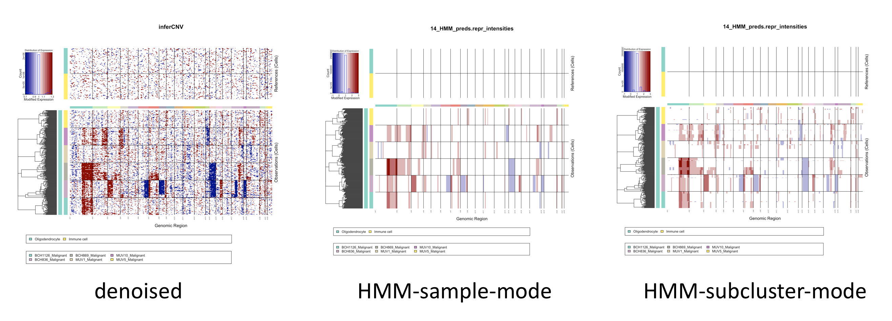

By setting **Analysis Mode to Subclusters**, inferCNV will attempt to partition cells into groups having consistent patterns of CNV.  CNV prediction (via HMM) would then be performed at the level of the subclusters rather than whole samples.

The view below shows differences obtained when performing HMM predictions at the level of whole samples as compared to subclusters. 

>TODO: show version w/ more cells, gives better resolution for subclusters.

The methods available for defining tumor subclusters will continue to be expanded.  We've currently had best success with using hierarchical clustering based methods.

## Tumor subclustering methods

### Tumor subclustering by partitioning hierarchical clustering trees

The parameters that impact the hierarchical clustering based tree partitioning include:

- Hierarchical Clustering Method = ward.D2  : the clustering method to use.  All built-in R hclust methods are supported.  We find 'ward.D2' (default) to work best.

- Tumor Subcluster Partition Method = Random Trees : method used for partitioning the hierarchical clustering tree.  Options include ('Random Trees', 'qnorm').  These are described further below.  Both methods rely on the Tumor Subcluster P-value = 0.05 setting for determining cut-points in the hierarchical tree.

#### Random Trees Method

This method was inspired by the [SHC method](https://www.ncbi.nlm.nih.gov/pmc/articles/PMC5708128/). We utilize a non-parameteric method that involves comparing the hierarchical tree height to a null distribution of tree heights derived from trees involving randomly permuted genes.  If the observed tree height is found to be statistically significant according to the Tumor Subcluster P-value = 0.05 setting, the tree is bifurcated.  This procedure is then applied recursively to the split trees and splitting will continue to occur until a maximum recursion depth is reached, the clade under study has too few members, or the subtree height is found to not be significant under the corresponding null distribution.  

An advantage of this method is that it will not partition a sample of cells if there's insufficient evidence for tumor heterogeneity.  A disadvantage is that the method is relatively slow, given that it needs to perform 100 separate tree constructions at each tested bifurcation in order to generate a null distribution.  However, parallelization is enabled and the Number of Threads = 4 can be further increased to speed up the process.

#### qnorm Method

This involves a parametric approach that cuts the hierarchical tree at the tree height quantile corresponding to the quantile of a normal distribution of the tree heights where the percentile = Tumor Subcluster P-value = 0.05.

The advantage of this approach is that it is a fast approach for exploring groups of cells that may represent tumor heterogeneity instead of being restricted to running all cells through as a single sample. The disadvantage is that it will split the hierarchical tree even when there is no true statistical evidence for heterogeneity. It is really only a simple dynamic way of exploring potential heterogeneity during an inferCNV run.

### Additional tumor subclustering methods

TBD 